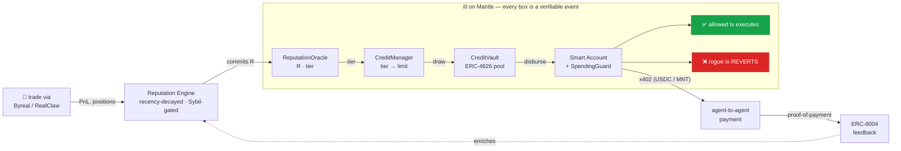

# the swing

**A reputation-gated credit layer for autonomous AI agents — on Mantle.**

An agent earns a **portable, verifiable reputation** from its real on-chain track
record (DEX trading PnL + ERC-8004 reputation signals). That reputation **gates
access to capital** — larger, partially- or under-collateralized credit lines drawn
from an on-chain credit vault. The capital is deployed through a **spending-controlled
smart account** whose guard **rejects rogue transactions on-chain** — per-tx caps,
rolling daily limits, allowlists. Agents pay each other for services over **x402**.

> The signature beat: a compromised key tries to drain the account, and the
> transaction **reverts on-chain** — a real, mined, `status 0` failure on the Mantle
> explorer ([see it](https://sepolia.mantlescan.xyz/tx/0x16d6faaff4087db6fe47647cc563bb75114f90dd6a02a856f8f86ce1f5335ff7)).
> Earn → reputation → credit → deploy → *safety*, every step a verifiable Mantle event.

This is infrastructure, not a single bot. It binds the three things autonomous
agents are missing — portable creditworthiness, safe custody of capital, and a
standard pay rail — into one composable economic layer.

**Status: live on Mantle Sepolia.** All 7 contracts deployed + **source-verified on
Mantlescan**, 91 passing Foundry tests (units + fuzz + invariants), and the full north-star
loop executed on-chain with real transactions (reputation commit → credit draw → allowed
spend → **rogue revert**). Addresses and tx hashes below.

---

## The loop



## Live & verified

**Deployed + source-verified on Mantle Sepolia (chainId 5003).** Deployer / oracle
signer: `0x4D6A7d6bF3C0a885D581AacEC0345526bd33273E`.

| Contract | Address (verified source) |
|---|---|
| MockUSDC (vault asset / faucet) | [`0xa297…B09d`](https://sepolia.mantlescan.xyz/address/0xa29799A188C220B17788a355Ec0166523172B09d#code) |
| ReputationOracle (**2-of-3 committee**) | [`0xe009…6632`](https://sepolia.mantlescan.xyz/address/0xe00962601106D055be7A1f97CD53c9C7B4b46632#code) |
| CreditVault (ERC-4626) | [`0x0aD2…b114`](https://sepolia.mantlescan.xyz/address/0x0aD20c99D72AA4371317a85A85Ce39C318a2b114#code) |
| CreditManager | [`0x1be4…31a8`](https://sepolia.mantlescan.xyz/address/0x1be497f127561a8F3e53aF53452Ce6cdC09e31a8#code) |
| GuardedAccountFactory | [`0xB1cc…B997`](https://sepolia.mantlescan.xyz/address/0xB1ccd35E453eB0a4eeD05a3AE0BFC638B397B997#code) |
| SpendingGuardHook (ERC-7579 Type 4) | [`0x9A07…98Bb`](https://sepolia.mantlescan.xyz/address/0x9A0735F793e438b63241252EB54ef7B519E698Bb#code) |
| SpendingGuardValidator (ERC-7579 Type 1) | [`0x60C3…E2C3`](https://sepolia.mantlescan.xyz/address/0x60C3C40566a932bAcA3AfD23699C38e9F0F3E2C3#code) |

Canonical record: [`contracts/deployments/5003.json`](contracts/deployments/5003.json). The
ReputationOracle is a **2-of-3 signer committee** (threshold 2) — no single key can fabricate a
score; the engine signs commits with a quorum of the committee keys.

### The full loop, executed on-chain (agentId 1)

Re-run on the committee deployment — agent 1's GuardedAccount is
[`0xA6f857…9365`](https://sepolia.mantlescan.xyz/address/0xA6f857F91C57f6DaC7BAf5F4A2abfA026A729365).

| Step | Result | Tx |
|---|---|---|
| 1. Reputation commit | `R = 832` → tier **T3 (Trusted)**, via the **2-of-3 committee** | [`0x731c624f…`](https://sepolia.mantlescan.xyz/tx/0x731c624fb9b1e3dfd32bbb6e41b3ad45924d5510587ebfb2b7e300ccdf5b83dc) |
| 2. Credit line | borrowing power **37,945 USDC** = `creditLimit(832)` | [`0xcb3ec6f5…`](https://sepolia.mantlescan.xyz/tx/0xcb3ec6f549293339f92b6c0398af3b216f5853562606986c622ea8fc7c9bf265) |
| 3. Draw | **5,000 USDC** disbursed to the guarded account | [`0xb0746f28…`](https://sepolia.mantlescan.xyz/tx/0xb0746f283819fa9dcee92a52013c6d57cbf014f290a60e30f6320e8ae7611e9c) |
| 4. Allowed spend | **1,000 USDC** → allowlisted merchant ✅ | [`0x9147444b…`](https://sepolia.mantlescan.xyz/tx/0x9147444b664c4a67c5803569269ff0147ea9d169ac51e38a5b34a057fad2f8a2) |
| 5. **Rogue spend** | → non-allowlisted attacker → **REVERTED** (`status 0`, attacker balance `0`) | [`0x16d6faaf…`](https://sepolia.mantlescan.xyz/tx/0x16d6faaff4087db6fe47647cc563bb75114f90dd6a02a856f8f86ce1f5335ff7) |

Step 5 is the prize beat: a real, mined, **failed** transaction — the `SpendingGuard`
rejecting a drain attempt inside the EVM. The difference between *telling* an agent not
to misbehave and *making it impossible*.

### What's wired, end-to-end

- **Reputation engine** — scores realized PnL (30-day half-life decay, Sybil-gated) and
  **auto-commits** `R ∈ [0,1000]` to the Oracle with an `evidenceHash` binding the commit
  to its exact inputs (recomputable / auditable). 7 passing scoring tests.
- **No single key can fake reputation** — the `ReputationOracle` is a **k-of-n signer
  committee**: a commit needs `threshold` signatures from distinct, owner-managed signers over
  a digest bound to `(chainId, oracle, agentId, score, evidenceHash, nextEpoch)`. Submitting is
  permissionless (the quorum's signatures carry the authority); signatures can't be replayed
  across chains, deployments, or epochs. Deploy 1-of-1 for dev, 2-of-3 for the demo. → *the
  honest answer to "what stops you assigning yourself a score?"*
- **Real on-chain PnL** — indexes a live Mantle trader's DEX swaps (Merchant Moe / Agni)
  via the Etherscan V2 account API, reconstructs realized PnL in USD from stablecoin legs,
  and scores it. Not simulation — every trade is a public Mantle tx. (`/agents` → *Live
  Mantle trader* panel, with its provenance shown inline.) Point `MANTLE_TRADER_ADDRESS` at a
  RealClaw / competition agent to benchmark it directly; the default is a curated stablecoin
  trader because clean PnL reconstruction needs stablecoin-legged round-trips.
- **x402 payments** — faithful HTTP-402 round-trip (`402 + accepts` → `X-PAYMENT` → `200 +
  X-PAYMENT-RESPONSE`) with **real on-chain USDC settlement**, Transfer-log verification,
  and replay protection. Proof-of-payment loops back as an ERC-8004 reputation commit.
- **Z.ai GLM** — live natural-language explanations of each credit decision (`glm-4.5-flash`),
  with a deterministic template fallback on missing key / provider error.
- **Wallet-connected product flows** — connect an injected wallet (auto-switch / add Mantle
  Sepolia), **lend** on `/vault` (faucet → approve → deposit → withdraw, ERC-4626), or
  **launch your own agent** on `/launch` (engine attests reputation → your wallet signs
  create → openLine → draw). User-signed, not a server puppet.
- **Safety** — the `SpendingGuard` six-check ladder lives in one Solidity library used by
  **both** the ERC-7579 module **and** a direct `GuardedAccount`, so the rogue-tx revert
  never depends on bundler / AA infra.

## Pieces

| Layer | What it is | Where |
|---|---|---|
| **Identity** | ERC-8004 agentId per agent; `agentWallet` → the smart account | `ReputationOracle` |
| **Reputation** | off-chain engine scores PnL + ERC-8004 signals → `R ∈ [0,1000]`, committed on-chain | `apps/engine`, `ReputationOracle` |
| **Credit** | ERC-4626 lender pool + a `CreditManager` opening reputation-tiered credit lines | `contracts` |
| **Safety** | `SpendingGuardLib` ladder → ERC-7579 Validator + Hook, and a direct `GuardedAccount` | `contracts/src` |
| **Payments** | x402 agent-to-agent settlement, proof-of-payment looped back as ERC-8004 feedback | `apps/engine` |
| **Reasoning** | Z.ai GLM narrates each credit decision (live) | `apps/engine` |
| **Dashboard** | landing · console · agents registry + live on-chain trader · vault (lend) · launch | `apps/web` |

## Repo layout

```
contracts/        Foundry — the spine (Solidity). On-chain is the source of truth.
  src/
    ReputationOracle.sol      R + tier per agentId, written by the engine signer
    CreditVault.sol           OZ ERC-4626 lender pool + inflation-attack mitigation
    CreditManager.sol         tier→limit math, open/draw/repay/liquidate
    libraries/
      TierMath.sol            pure: tier(R), limit(R), collateral factor
      SpendingGuardLib.sol    the six-check ladder, shared by module + fallback wallet
    modules/
      SpendingGuardValidator.sol   ERC-7579 Type 1 — reverts rogue txs in validation
      SpendingGuardHook.sol        ERC-7579 Type 4 — accounting + SpendBlocked/Allowed
    accounts/
      GuardedAccount.sol      minimal direct wallet (AA-independent demo fallback)
packages/shared/  TS: addresses, ABIs, tier-math mirror, shared types
apps/engine/      Node/TS reputation engine + indexer + x402 + GLM + on-chain PnL (Hono, viem)
apps/web/         Next.js dashboard — wallet connect, lender + operator-launch flows
docs/             PLAN.md · ARCHITECTURE.md · DEMO.md (run-of-show) · DEPLOYMENT.md · decisions/
```

## Quickstart

```bash
pnpm install
git submodule update --init --recursive   # forge libs (OZ, Solady, forge-std)
cp .env.example .env                       # RPC + a funded testnet signer; ZAI/Mantlescan keys optional

# contracts — 91 tests: units, fuzz, + invariants (guard never funds a rogue dest;
# borrowing power never exceeds the limit; vault accounting holds; committee quorum)
pnpm contracts:test

# run the stack (contracts are already deployed; addresses in contracts/deployments/5003.json)
ENGINE_PORT=8799 pnpm --filter @swing/engine start   # reputation engine + API on :8799
pnpm --filter @swing/web dev                          # dashboard on http://localhost:3000
```

The dashboard reads the engine on `:8799`. To exercise the wallet flows, point an injected
wallet (MetaMask / Rabby) at Mantle Sepolia — the app will prompt to switch / add it — and
grab gas from the [Mantle Sepolia faucet](https://faucet.sepolia.mantle.xyz); the in-app
faucet mints test USDC.

## Demo

The 90-second run-of-show, X thread, and judge Q&A are in [`docs/DEMO.md`](docs/DEMO.md).
The climax is beat 6→7: **Drain to attacker** → the card shakes red → click the tx →
Mantlescan shows **status 0 (failed)**.

## Built for

Turing Test Hackathon 2026 — Mantle × Bybit × Byreal × BGA — **Agentic Economy** track.
Core functionality runs end-to-end on Mantle; every reputation commit, credit decision, and
rejection is an on-chain event. Reasoning + natural-language explanations by **Z.ai GLM**.

Lineage: [`agent_fuel`](https://github.com/frankolien/agent_fuel) — the Solana ancestor of
this design.
