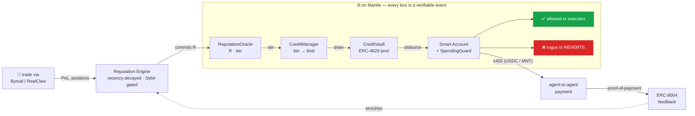

# the swing

**A reputation-gated credit layer for autonomous AI agents — on Mantle.**

An agent earns a **portable, verifiable reputation** from its real on-chain track
record (RealClaw / Byreal trading PnL + ERC-8004 reputation signals). That
reputation **gates access to capital** — larger, partially- or under-collateralized
credit lines drawn from an on-chain credit vault. The capital is deployed through a
**spending-controlled smart account** whose validator/hook modules **reject rogue
transactions on-chain** — per-tx caps, rolling daily limits, allowlists. Agents pay
each other for services over **x402**.

> The signature beat: a compromised key tries to drain the account, and the
> transaction **reverts on-chain, on stage**. Earn → reputation → credit → deploy →
> *safety*, every step a verifiable Mantle event.

This is infrastructure, not a single bot. It binds the three things autonomous
agents are missing — portable creditworthiness, safe custody of capital, and a
standard pay rail — into one composable economic layer.

---

## The loop



## Pieces

| Layer | What it is | Where |
|---|---|---|
| **Identity** | ERC-8004 Identity NFT per agent; `agentWallet` → the smart account | live singletons on Mantle |
| **Reputation** | off-chain engine scores PnL + ERC-8004 signals → `R ∈ [0,1000]`, committed on-chain | `apps/engine`, `ReputationOracle` |
| **Credit** | ERC-4626 lender pool + a `CreditManager` opening reputation-tiered credit lines | `contracts` |
| **Safety** | ERC-7579 `SpendingGuard` (Validator + Hook) — rogue txs revert in validation | `contracts/src/modules` |
| **Payments** | x402 agent-to-agent settlement, proof-of-payment looped back as ERC-8004 feedback | `apps/engine` |
| **Dashboard** | identity card · reputation gauge · credit tier · positions · live `SpendBlocked` panel | `apps/web` |

## Repo layout

```
contracts/        Foundry — the spine (Solidity). Most important; on-chain is the truth.
  src/
    ReputationOracle.sol      R + tier per agentId, written by the engine signer
    CreditVault.sol           OZ ERC-4626 lender pool + inflation-attack mitigation
    CreditManager.sol         tier→limit math, open/draw/repay/liquidate
    libraries/
      TierMath.sol            pure: tier(R), limit(R), collateral factor
      SpendingGuardLib.sol    the six-check ladder, shared by module + fallback wallet
    modules/
      SpendingGuardValidator.sol   ERC-7579 Type 1 — reverts rogue txs in validation
      SpendingGuardHook.sol        ERC-7579 Type 4 — accounting + SpendBlocked/Allowed
    accounts/
      GuardedAccount.sol      minimal direct wallet (AA-independent demo fallback)
packages/shared/  TS: addresses, ABIs, tier math mirror, shared types
apps/engine/      Node/TS reputation engine + indexer + x402 endpoint + GLM explanations
apps/web/         Next.js dashboard
docs/             PLAN.md (9-day), ARCHITECTURE.md, decisions/ (ADRs)
```

## Quickstart

```bash
pnpm install
git submodule update --init --recursive   # forge libs (OZ, Solady, forge-std)
cp .env.example .env            # fill testnet keys + RPC

# contracts
pnpm contracts:build
pnpm contracts:test             # includes the rogue-tx revert test

# services (after deploy)
pnpm engine:dev
pnpm web:dev
```

See [docs/PLAN.md](docs/PLAN.md) for the 9-day build plan and
[docs/ARCHITECTURE.md](docs/ARCHITECTURE.md) for the component contracts.

## Built for

Turing Test Hackathon 2026 — Mantle × Bybit × Byreal × BGA — **Agentic Economy** track.
Core functionality runs end-to-end on Mantle; every reputation commit, credit
decision, and rejection is an on-chain event.

Reasoning + natural-language explanations by **Z.ai GLM**. Lineage:
[`agent_fuel`](https://github.com/frankolien/agent_fuel) — the Solana ancestor of
this design.
